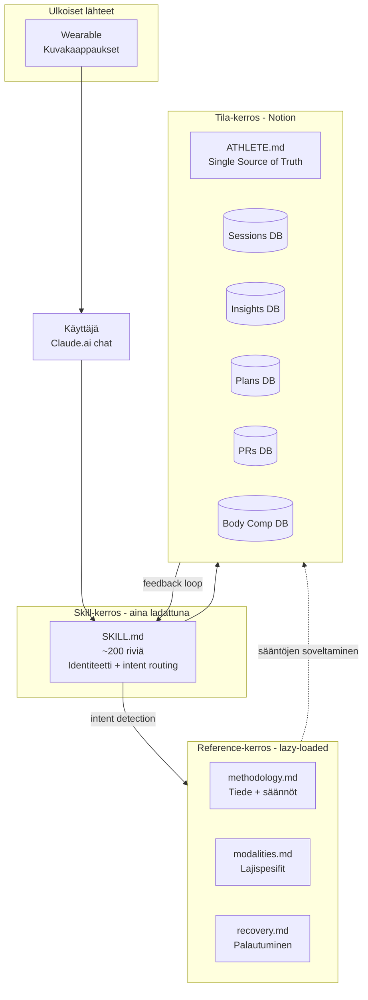

# TrainerClaude Coach

> **Henkilökohtainen, näyttöön perustuva multi-modal urheilukoutsi rakennettuna Claude Skills -arkkitehtuurin päälle.** Demonstrointi modulaarisesta prompt-suunnittelusta syvän domain-asiantuntemuksen vaativissa LLM-agenteissa.

---

## Tiivistelmä

TrainerClaude on toimiva AI-koutsijärjestelmä, joka soveltaa urheilutieteen periaatteita yksittäisen urheilijan ("Athlete X") multi-modaaliseen treeniin (voima, kestävyys, lajiharjoittelu). Yhdistää Claude Skills -ominaisuuden, Notion-tietokannat ja workflow-pohjaisen intent-reitityksen.

Repo demonstroi arkkitehtonisia ratkaisuja, joita syvä-domain LLM-agentit vaativat: kontekstinhallinta, ulkoistettu tila, deterministinen reititys ja sääntöjen eksplisiittinen koodaus.

---

## Ongelma

Geneeriset LLM-keskustelut treeniaiheista kärsivät tyypillisistä rajoitteista:

- **Hallusinoivat numeroita** — keksivät sykealueita ja volyymisuosituksia epäjohdonmukaisesti
- **Eivät säilytä tilaa** — joka keskustelu alkaa tyhjältä pöydältä, ei trendianalyysiä
- **Eivät erota turvakriittistä päätöksentekoa rutiinineuvonnasta** — sama luottamustaso kaikille väitteille

Tämä projekti rakentaa rakenteellisen ratkaisun yhdessä rajatussa domainissa, toivoen periaatteiden olevan yleistettäviä.

---

## Arkkitehtuuri



**Tietovirta yhdessä vuorovaikutuksessa:**

1. Käyttäjä jakaa sessiotiedot (kellokuva + sRPE)
2. SKILL.md tunnistaa intentin → lataa relevantit reference-tiedostot
3. Hakee Notion-tilan (edelliset sessiot, akuuttiprotokollan status, tavoitteet)
4. Soveltaa sääntöjä (ACWR-laskenta, intensiteettijakauma, concurrent training)
5. Tuottaa vastauksen + päivittää Notionin tarvittaessa

---

## Keskeiset suunnitteluratkaisut

### 1. Modulaarinen lazy-loading

Pää-skill (SKILL.md) on kevyt (~200 riviä) ja sisältää vain identiteetin, intent-reitityksen, sykealueet ja pakottavat säännöt. Syvempi tieto ladataan erillisistä reference-tiedostoista vain kun niitä tarvitaan.

Kontekstibudjetti on rajallinen resurssi. Eager-loading 2000+ rivin domain-tiedosta jokaiseen viestiin vähentää fokusta ja kasvattaa hallusinaatioriskiä irrelevantissa kontekstissa.

*Tradeoff:* Vaatii tarkemman intent-reitityksen — väärä reference-tiedosto johtaa vääriin vastauksiin.

### 2. Workflow-pohjainen intent-reititys

SKILL.md sisältää eksplisiittisen taulukon 9 erilaiselle käyttötapaukselle (sessio jaettu, status, viikkosuunnitelma, Sunday Review, akuutti tila, jne.). Jokainen ohjaa määriteltyyn workflow'hun.

Eksplisiittiset workflow'r tekevät vastauksista deterministisempiä ja auditoitavampia. Käyttäjä voi luottaa siihen, että sama tilanne käsitellään samalla tavalla.

### 3. Eksplisiittinen sääntökoodaus numeroina

Kaikki säännöt taulukoitu konkreettisilla numeroilla: ACWR 0.8–1.3 = sweet spot, MAV-volyymitavoite kohdelihasryhmälle 12–16 sarjaa/vk, sykealueet bpm-rajoilla, RIR-tavoitteet, deload-kriteerit.

LLM:t hallusinoivat numeroita herkimmin alueilla, joilla niiden pitäisi olla tarkkoja. Eksplisiittinen säännöstö taulukkomuodossa toimii groundauksena vapaamuotoisen päättelyn sijaan.

### 4. Eksternalisoitu tila (Notion)

Claude on stateless — tilatieto (sessiohistoria, mittaukset, suunnitelmat) säilytetään Notion-tietokannoissa. ATHLETE.md on Single Source of Truth pysyvälle profiilille.

Trendianalyysi (ACWR, viikkokuorma, pitkän aikavälin patternit) vaatii pysyvää, jäsenneltyä dataa. Notion antaa myös käyttäjälle näkyvyyden ja muokkausoikeudet järjestelmän "muistiin".

### 5. State machine kriittisille tilanteille

Akuuttiprotokolla (terveysriskien hallinta) on eksplisiittinen state machine: trigger-ehdot → entry → constraints aktiivisena → exit-kriteerit.

Turvakriittinen päätöksenteko ei voi olla "luultavasti" tai "näin yleensä suositellaan". Eksplisiittinen tila varmistaa, että LLM ei improvisoi alueella, jossa virhe maksaa.

### 6. Versionhallinta ja feedback loop

SKILL.md sisältää versionumeron ja changelogin. Insights-tietokanta kerää havaintoja säännöistä, jotka osoittautuvat vääriksi → säännöt päivittyvät SKILL.md:hen.

Käyttäjän vastustus sääntöä kohtaan on signaali — joko sääntö on väärin tai käyttäjä on väärin, ja kumpi tahansa kuuluu tutkia datalla.

---

## Esimerkki vuorovaikutuksesta

**Käyttäjä:** Jakaa kuvakaappauksen Hyrox-treenistä: 70 min, keskim. syke 158, max 184, palautumisaika 48 h, sykealueet Z3-painotteinen.

**Järjestelmä:**

1. *Intent detection:* "Sessio jaettu" → lataa `modalities.md` (Hyrox) + `methodology.md` (kuormitusmittarit)
2. *Notion query:* Hakee edelliset 7 päivän sessiot
3. *sRPE pyyntö:* "Mikä oli sRPE 30 min session jälkeen?" (jos puuttuu)
4. *Sääntöjen soveltaminen:*
   - 70 min × sRPE 8 = 560 AU
   - Viikon kuorma: 1840 AU
   - ACWR: 1.4 → flag (yli sweet spotin)
   - Intensiteettijakauma: 62 % Z3 → flag (polarized-malli rikkoutuu)
5. *Vastaus:* Numeropohjainen analyysi + ehdotukset + tarvittaessa akuuttiprotokollan flag

Tämä on **lähes mahdoton geneerisellä Claude.ai-keskustelulla** ilman edellistä rakennetta — LLM ei muista edellisiä sessioita eikä sovella ACWR-laskentaa kontekstissa.


---

## Mitä opin prompt engineeringistä

**1. Kontekstibudjetti on rajallinen resurssi, ei ilmainen.** Yritin aluksi sulauttaa kaiken yhteen promptiin. Tulos: LLM "tiesi" kaiken paperilla mutta käytti tietoa epäjohdonmukaisesti. Modulaarisessa rakenteessa fokus paranee ja hallusinaatiot vähenevät.

**2. Strukturoitu data > vapaa proosa kriittisissä päätöksissä.** Numerot taulukoissa ja eksplisiittiset workflow-templates tuottavat toistettavia vastauksia siellä missä vapaamuotoinen päättely tuottaa vaihtelua. "Mieti mikä on paras" → vaihtelua. "Käy nämä 5 askelta järjestyksessä" → konsistenssi.

**3. Tila pitää eksternalisoida** kun keskustelut ovat lyhyitä mutta domain pitkä. LLM:n "muisti" on illusorinen; oikea tila tarvitsee tietokannan.

**4. Käyttäjän vastustus on signaali, ei häiriö.** Kun käyttäjä toistuvasti vastusti tiettyä sääntöä, pyrkimys oli aluksi vakuuttaa käyttäjä uudelleen. Oikea reaktio: tutkia, miksi sääntö ei sovi yksilölle, ja päivittää järjestelmää. Järjestelmä ei ole auktoriteetti, vaan työkalu, joka iteroi käyttäjän kanssa.

Syvempi pohdinta löytyy prompt-engineering.md tiedostosta.

---

## Tieteellinen pohja

Järjestelmä koodaa eksplisiittisesti seuraavat periaatteet:

- **Foster 1998** — sRPE-pohjainen kuormamittaus
- **Gabbett 2016 / Soligard et al. 2016** — Acute:Chronic Workload Ratio
- **Banister 1991** — CTL/ATL/TSB Fitness-Fatigue-malli
- **Seiler 2010** — Polarized training intensity distribution
- **Hickson 1980 / Coffey & Hawley 2017** — Concurrent training interference
- **Israetel et al. 2017** — Renaissance Periodization MEV/MAV/MRV
- **Rhea et al. 2002** — Daily Undulating Periodization
- **Zourdos et al. 2016** — RIR-pohjainen RPE voimaharjoittelussa
- **Plews & Buchheit 2017** — HRV-monitorointi


Järjestelmä välttää tieteellisesti heikosti perusteltuja claimeja (esim. cycle-pohjainen periodisaatio, "ihme" -palautumistekniikat) — tämä on tietoinen suunnittelupäätös.

---

## Repon rakenne

```
trainerclaude-coach/
├── README.md
├── ARCHITECTURE.md              # Syvempi arkkitehtuurikuvaus
├── CHANGELOG.md                 # v1.0 → v2.2 evoluutio
├── docs/
│   ├── design-decisions.md      # ADR-tyyliset päätösperustelut
│   └── prompt-engineering.md    # Lessons learned
├── skill/
│   ├── SKILL.md                 # Pää-skill (lazy router)
│   ├── methodology.md           # Tieteelliset säännöt
│   ├── modalities.md            # Lajispesifit protokollat
│   └── recovery.md              # Palautumismetodologia
├── notion-schema/
│   ├── athlete-profile.md
│   ├── sessions-db.md
│   ├── insights-db.md
│   └── plans-db.md
├── examples/
│   ├── 01-session-analysis.md
│   ├── 02-sunday-review.md
│   ├── 03-acute-protocol.md
│   └── 04-plan-generation.md
└── references/
    └── scientific-sources.md
```

---

## Käyttöönotto

Järjestelmä on suunniteltu **Claude Projects** -ominaisuuden päälle (claude.ai):

1. Luo Claude Project
2. Kopioi `skill/`-kansion tiedostot projektin tietopohjaan
3. Duplikoi Notion-template (linkki tulossa) omaan workspaceen
4. Täytä ATHLETE.md omilla tiedoillasi
5. Aloita keskustelu jakamalla harjoitusdataa

Tämä on showcase eikä production-ready end-user-tuote. Tarkoituksena on demonstroida arkkitehtonisia valintoja.

---

## Lisenssi

MIT — vapaasti käytettävissä ja muunneltavissa.

---

## English Summary

**TrainerClaude Coach** is a working AI training coach system built on Claude Skills, demonstrating modular prompt architecture for deep-domain LLM agents. It applies evidence-based sports science principles to a single athlete's multi-modal training.

**Key architectural decisions:**

- **Modular lazy-loading** — lightweight core skill (~200 lines) routes to specialized reference files only when needed, preserving context budget
- **Workflow-based intent routing** — explicit table maps 9 use cases to defined workflows for deterministic responses
- **Explicit rule encoding** — scientific rules encoded as numeric tables (not prose) to ground LLM against hallucination in safety-sensitive domains
- **Externalized state via Notion** — Claude is stateless; persistent memory lives in structured databases owned by the user
- **State machine for acute conditions** — health-critical decision-making is structured as an explicit state machine, not free-form reasoning
- **Versioned rules with feedback loop** — Insights database captures rule failures, driving iterative improvement

**What this project demonstrates beyond "I wrote a prompt":**

- Systems thinking for LLM-based domain agents
- Context budget management as a first-class design concern
- Separation of immutable knowledge (skill files) from mutable state (Notion)
- Engineering discipline applied to prompt design (versioning, changelog, design decisions)
